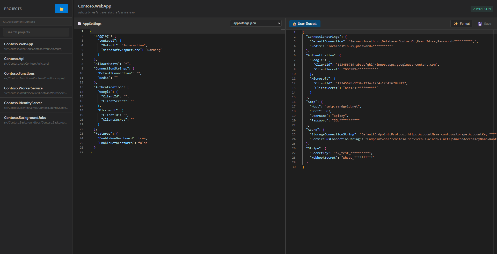

# User Secrets Manager

A desktop application for managing .NET User Secrets with a modern, intuitive interface.



## Features

- **Project Discovery** - Automatically scans directories for .NET projects with User Secrets configured
- **Visual Secret Editing** - Edit secrets using a rich JSON editor with syntax highlighting
- **AppSettings Comparison** - View your `appsettings.json` and `appsettings.Development.json` side-by-side with secrets
- **Copy AppSettings to Secrets** - Quickly copy configuration from appsettings files to your secrets
- **Cross-Platform** - Works on Windows, macOS, and Linux
- **Auto-Updates** - Automatically checks for and installs updates

## Installation

### Windows

Download the latest installer from the [Releases](https://github.com/sholman/UserSecretManager/releases) page:

- **Setup Installer** (`User Secrets Manager Setup x.x.x.exe`) - Installs to Program Files with Start Menu shortcuts
- **Portable** (`User Secrets Manager x.x.x.exe`) - Single executable, no installation required

### macOS

Download the `.dmg` file from [Releases](https://github.com/sholman/UserSecretManager/releases) and drag to Applications.

### Linux

Download the `.AppImage` or `.deb` package from [Releases](https://github.com/sholman/UserSecretManager/releases).

## Usage

1. **Launch the app**
2. **Select a folder** containing your .NET projects
3. **Browse projects** in the left sidebar - projects with User Secrets are automatically detected
4. **Edit secrets** in the JSON editor
5. **Save changes** with `Ctrl+S` or the Save button

### Keyboard Shortcuts

| Action | Shortcut |
|--------|----------|
| Save | `Ctrl+S` / `Cmd+S` |
| Format JSON | `Shift+Alt+F` |
| Undo | `Ctrl+Z` / `Cmd+Z` |
| Redo | `Ctrl+Y` / `Cmd+Shift+Z` |

## What are .NET User Secrets?

User Secrets is a .NET feature for storing sensitive configuration (API keys, connection strings, etc.) outside your project directory during development. Secrets are stored in:

- **Windows**: `%APPDATA%\Microsoft\UserSecrets\<UserSecretsId>\secrets.json`
- **macOS/Linux**: `~/.microsoft/usersecrets/<UserSecretsId>/secrets.json`

Learn more: [Safe storage of app secrets in development in ASP.NET Core](https://docs.microsoft.com/en-us/aspnet/core/security/app-secrets)

## Development

### Prerequisites

- [Node.js](https://nodejs.org/) 18 or later
- npm

### Setup

```bash
cd src/SecretsManagerElectron
npm install
```

### Run in Development

```bash
npm start
```

### Run in Demo Mode

Demo mode uses sample data instead of scanning your actual projects:

```bash
npm run demo
```

### Build

```bash
# Windows
npm run build:win

# macOS
npm run build:mac

# Linux
npm run build:linux
```

Build outputs are in the `dist/` folder.

## License

MIT

## Contributing

Contributions are welcome! Please feel free to submit a Pull Request.
